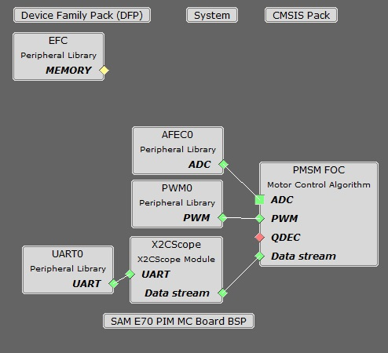

# PMSM FOC using PLL Estimator

This example application shows how to control the Permanent Magnet Synchronous Motor (PMSM) with PLL Estimator based Field Oriented Control (FOC) on a SAME70 Micro-controller. 

## Description

Permanent Magnet Synchronous Motor (PMSM) is controlled using Field Oriented Control (FOC). Rotor position and speed is determined using PLL estimator technique. Motor start/stop operation is controlled by the switch and motor speed can be changed by the on-board potentiometer. Waveforms and variables can be monitored runtime using X2CScope. 

Key features enabled in this project are:

- Dual shunt current measurement
- Speed control loop
- Field weakening

## MHC Project Configurations

- **AFEC Peripheral**: 

    The AFEC is used to measure analog quantities. Four channels are used to measure the Phase Current U, the Phase Current V, the DC Bus Voltage and the Potentiometer. Conversion is triggered at the PWM (zero match + offset of the switch delay) 
- **PWM Peripheral**: 

    This peripheral is used to generated three phase synchronous PWM waveforms. Fault functionality is also enabled to switch off the output waveforms asynchronously.
- **X2CScope**: 

    This component adds X2C scope protocol code. This uses UART to communicate to the host PC. X2CScope allows user to monitor variables runtime.
- **UART Peripheral**: 

    The UART is used for X2CScope communication to observe graphs and variable values in run time 

## Project Details
For details refer [Harmony QSpin](https://microchip-mplab-harmony.github.io/motor_control/index.html)

## Development Kits

### MCLV2 with ATSAME70 PIM
#### Downloading and building the application

To clone or download this application from Github, go to the [main page of this repository](https://github.com/Microchip-MPLAB-Harmony/mc_apps_sam_e7x_s7x_v7x) and then click **Clone** button to clone this repository or download as zip file.
This content can also be downloaded using content manager by following these [instructions](https://microchip-mplab-harmony.github.io/contentmanager/).

Path of the application within the repository is **apps/mcp_pmsm_foc_pll_estimator_sam_e70** .

To build the application, refer to the following table and open the project using its IDE.

| Project Name      | Description                                    | Hardware Setup Guide |
| ----------------- | ---------------------------------------------- | ----------------- |
| mclv2_sam_e70_pim.X | MPLABX project for MCLV2 board with ATSAME70 PIM | [Hardware Setup and Running The Application on MCLV2 with ATSAME70 PIM](../docs/mclv2_atsame70_pim_sensorless.md)|
|||

### MCHV3 with ATSAME70 PIM
#### Downloading and building the application

To clone or download this application from Github, go to the [main page of this repository](https://github.com/Microchip-MPLAB-Harmony/mc_apps_sam_e7x_s7x_v7x) and then click **Clone** button to clone this repository or download as zip file.
This content can also be downloaded using content manager by following these [instructions](https://microchip-mplab-harmony.github.io/contentmanager/).

Path of the application within the repository is **apps/mcp_pmsm_foc_pll_estimator_sam_e70** .

To build the application, refer to the following table and open the project using its IDE.

| Project Name      | Description                                    | Hardware Setup Guide |
| ----------------- | ---------------------------------------------- | ----------------- |
| mchv3_sam_e70_pim.X | MPLABX project for MCHV3 board with ATSAME70 PIM | [Hardware Setup and Running The Application on MCHV3 with ATSAME70 PIM](../docs/mchv3_atsame70_pim_sensorless.md)|
|||
