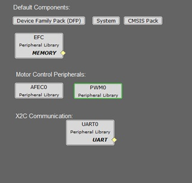
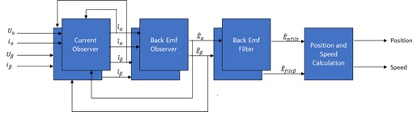
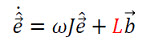
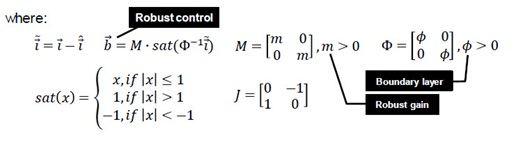
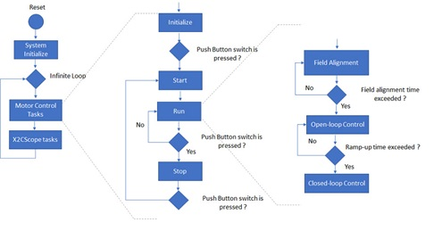
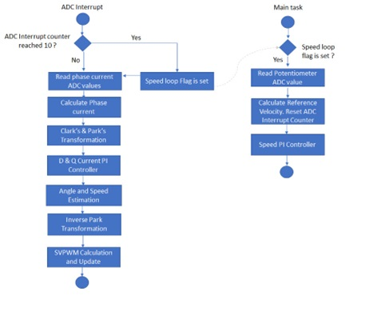
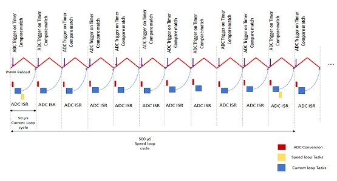

# PMSM FOC using Sliding Mode Observer

This example application shows how to control the Permanent Magnet Synchronous Motor (PMSM) with Sliding Mode Observer based Field Oriented Control (FOC) on a SAME70 Micro-controller. 

**Description**

Permanent Magnet Synchronous Motor (PMSM) is controlled using Field Oriented Control (FOC). Rotor position and speed is determined using Sliding Mode Observer (SMO) technique. Motor start/stop operation is controlled by the switch and motor speed can be changed by the on-board potentiometer. Waveforms and variables can be monitored runtime using X2CScope. 

Key features enabled in this project are:

- Dual shunt current measurement
- Speed control loop

**MHC Project Configurations**

- **AFEC Peripheral**:

The AFEC (ADC) is used to measure analog quantities. Four channels are used to measure the Phase Current A, the Phase Current B, the DC Bus Voltage and the Potentiometer. Conversion is triggered at the PWM (zero match + offset of the switch delay)

- **PWM Peripheral**:

This peripheral is used to generated three phase synchronous PWM waveforms. Fault functionality is also enabled to switch off the output waveforms asynchronously

- **UART Peripheral**:

The UART is used for X2CScope communication to observe graphs and variable values in run time

**Control Algorithm**

This section briefly explains the FOC control algorithm, software design and implementation.  

Field Oriented Control is the technique used to achieve the decoupled control of torque and flux. This is done by transforming the stator current quantities (phase currents) from stationary reference frame to torque and flux producing currents components in rotating reference frame using mathematical transformations. The Field Oriented Control is done as follows: 

1. Measure the motor phase currents. 
2. Transform them into the two phase system (a, b) using the Clarke transformation. 
3. Calculate the rotor position angle. 
4. Transform stator currents into the d,q-coordinate system using the Park transformation. 
5. The stator current torque (iq) and flux (id) producing components are controlled separately by the controllers. 
6. The output stator voltage space vector is transformed back from the d,q-coordinate system into the two phase system fixed with the stator by the Inverse Park transformation. 
7. Using the space vector modulation, the three-phase output voltage is generated. 

**Sliding Mode Observer (SMO)** :

Sliding Mode Observer is used to estimate the rotor position and thus speed. The electrical rotor position and speed is calculated using the Sliding Mode Observer. The main disadvantage of SMO Observer is its inability to estimate the rotor angle at lower rotor speeds because of very low value of back EMF. Therefore, the FOC algorithm also integrates the ramp-up profile for motor start. The reference speed is incremented linearly using a open loop phase voltage control until the required minimum reference speed for the SMO observer is reached.

The Sliding Mode Observer ( SMO ) is based on the principle of sliding mode control. It generates a sliding motion on the error between the plant output and the output of the observer such it produces a set of states that are precisely drives the estimated output to the actual output of the plant.

The sliding mode observer consists of a model based current observer followed by a back EMF Observer. The observed back EMF is filtered and then used to extract the position information from it. The following figure shows a typical Sliding Mode Observer:

The current and back EMF observer is modeled in discrete time by following equations:

Current Observer:

Back EMF Observer:

The following block diagram shows the software realization of the FOC algorithm.

**Software Design**

The following figure shows the various state machines of the the motor control software.

In the software, the PMSM speed control task is realized by a state machine as shown in the previous figure. The following sections briefly describes the various states in the PMSM speed control task:

1. **Initialize**:

In this state, following tasks are performed:
Initialization and configuration of NVIC, AFEC, PWM motor control peripherals for generation of periodic ADC triggers and ADC conversion interrupt
Current Offset measurement and calibration
Initialize PI controller parameters for speed and current control loops

2. **Start**:

In this state, the motor control state variables are reset and periodic ADC conversion interrupt is enabled. Control waits for the switch press.

3. **Run**:

In this state, the motor starts spinning. The following flow chart and the timing diagram shows the tasks performed in run state: 

In run state, two threads are executed- Main task thread and ADC Interrupt task thread. The current control and speed control is carried out in the ADC interrupt task thread. The main task thread monitors the external switches and maintains the state machine. Therefore, the ADC interrupt cycle indicates the current and speed control frequency.

As pointed out earlier, the SMO is unable to estimate the rotor position information at the start-up phase when the speed is very low. This necessitates the motor control algorithm to integrate an open-loop control mechanism to linearly ramp the motor speed to the required minimum speed before switching over to closed loop control. Therefore, the motor control state can further be classified into three sub-states - Field Alignment, Open-loop Control and Close-loop Control.

**Field Alignment**:
    In this mode, a limited value of DC current is applied to the U phase of PMSM motor in order to align the rotor magnetic field with the U-phase of the motor. The time for which DC current has to be applied to achieve the field alignment depends on the time constant of the PMSM motor drive.

**Open Loop Control**:
    In this mode, the speed of the PMSM motor is gradually ramped up using an open loop control. The speed is ramped up linearly to a minimum value required for the sensor-less SMO observer to estimate the speed of the PMSM motor with required accuracy.

**Close Loop Control**:
    In this mode, the speed can be regulated using closed loop SMO based sensor-less FOC algorithm.

4. **Stop**:
In this state, the PWM channels are disabled thereby stopping the motor. The periodic ADC trigger and conversion interrupt is disabled.

**Software Configurations**

1. The PWM controller frequency ( in Hz ) can be configured by setting the following macro in userparams.h file.
**This frequency should be same as the frequency configured in the PWM peripheral in the MHC.**

| Macro      | Description                                    |
| ----------------- | ---------------------------------------------- |
| PWM_FREQUENCY | Current controller and PWM frequency in Hz |
|||

2. Setting motor specific -parameter:
Set the motor following motor parameters in userparams.h file. 

| Macro      | Description | Unit |
| ----------------- | ----------------|---------------------------------------------- |
| MOTOR_PER_PHASE_RESISTANCE | Motor per phase resistance | ohm |
| MOTOR_PER_PHASE_INDUCTANCE | Motor per phase inductance | H |
| MOTOR_BACK_EMF_CONSTANT_Vpeak_Line_Line_KRPM_MECH | Back EMF constant | Vpk(L-L)/KRPM |
| NOPOLESPAIRS | Number of pole pairs |  |
| NOMINAL_SPEED_RPM | Rated mechanical speed of the motor | RPM |
||||

3. Setting PI Controller parameters:
Depending on the type of motor used, and the corresponding application PI controller parameters should to be updated in userparams.h file.

Parameters for speed Control loop: 

| Macro      | Description                                    |
| ----------------- | ---------------------------------------------- |
| SPEEDCNTR_PTERM | Proportional gain of speed control loop |
| SPEEDCNTR_ITERM | Integral gain of speed control loop |
| SPEEDCNTR_CTERM | Anti-windup term of speed control loop |
| SPEEDCNTR_OUTMAX | Maximum controller output of speed control loop |
|||

Parameters for Id current loop: 

| Macro      | Description                                    |
| ----------------- | ---------------------------------------------- |
| D_CURRCNTR_PTERM | Proportional gain of Id current control loop |
| D_CURRCNTR_ITERM | Integral gain of Id current control loop |
| D_CURRCNTR_CTERM | Anti-windup term of Id current control loop |
| D_CURRCNTR_OUTMAX | Maximum controller output of Id current control loop |
|||

Parameters for Iq current loop: 

| Macro      | Description                                    |
| ----------------- | ---------------------------------------------- |
| Q_CURRCNTR_PTERM | Proportional gain of Iq current control loop |
| Q_CURRCNTR_ITERM | Integral gain of Iq current control loop |
| Q_CURRCNTR_CTERM | Anti-windup term of Iq current control loop |
| Q_CURRCNTR_OUTMAX | Maximum controller output of Iq current control loop |
|||

4. Debugging Features:
Open loop functioning is useful for debugging when using new motor. This feature can be enabled by setting the following  macros in userparams.h file.

Parameters for Iq current loop: 

| Macro      | Description                                    |
| ----------------- | ---------------------------------------------- |
| OPEN_LOOP_FUNCTIONING | Open loop enable switch (0 - Disable, 1 - Enable ) |
| Q_CURRENT_REF_OPENLOOP | Startup current in open loop |
|||

**Development Kits**

**MCLV2 with ATSAME70 PIM**
Downloading and building the application

To clone or download this application from Github, go to the [main page of this repository](https://github.com/Microchip-MPLAB-Harmony/mc_apps_sam_e7x_s7x_v7x) and then click **Clone** button to clone this repository or download as zip file.
This content can also be downloaded using content manager by following these [instructions](https://microchip-mplab-harmony.github.io/contentmanager/).

Path of the application within the repository is **apps/pmsm_foc_smo_sam_e70** .

To build the application, refer to the following table and open the project using its IDE.

| Project Name      | Description                                    | Hardware Setup Guide | 
| ----------------- | ---------------------------------------------- | ------------------ |
| mclv2_sam_e70_pim.X | MPLABX project for MCLV2 board with ATSAME70 PIM | [Hardware Setup and Running The Application on MCLV2 with ATSAME70 PIM](GUID-08B08E4E-BC65-4CAF-9730-FB068BEDE8B8.md)|
|||

