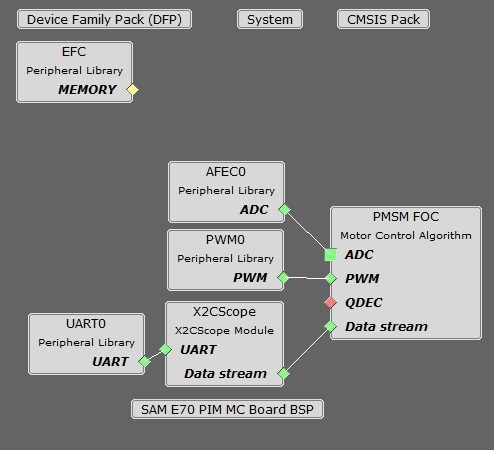
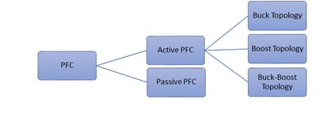
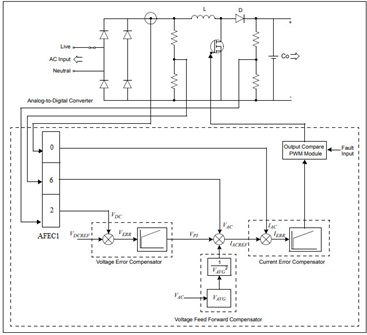
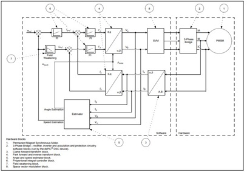
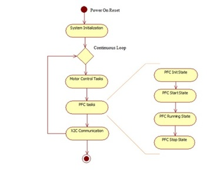
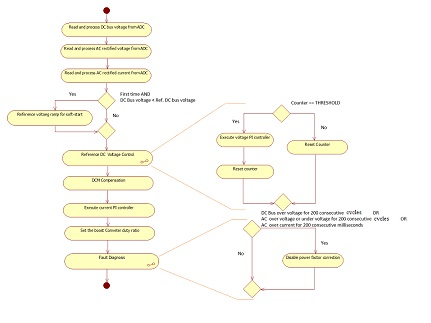
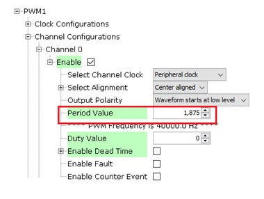

# Power Factor Correction with PMSM FOC using PLL Estimator

This example application shows how to control the Permanent Magnet Synchronous Motor (PMSM) with PLL Estimator based Field Oriented Control (FOC) along with Power Factor Correction (PFC)on a SAME70 Micro-controller. 

**Description**

Power Factor Correction ( PFC ) shapes the input current drawn from the AC mains to be in synchronization with the input AC voltage. This project uses Boost-Converter topology to carry out the Power Factor Correction. Permanent Magnet Synchronous Motor (PMSM) is controlled using Field Oriented Control (FOC). Rotor position and speed is determined using PLL estimator technique. Motor start/stop operation is controlled by the switch and motor speed can be changed by the on-board potentiometer. Waveforms and variables can be monitored runtime using X2CScope. 

Key features enabled in this project are:

- Power factor correction
- Dual shunt current measurement
- Speed control loop
- Field weakening

**MHC Project Configurations**

-   **AFEC Peripheral**:

The AFEC0 peripheral is used to measure analog quantities for motor control operation. Four channels are used to measure the Phase Current A, the Phase Current B, the DC Bus Voltage and the Potentiometer. Conversion is triggered at the PWM (zero match + offset of the switch delay)

The AFEC1 peripheral is used to measure analog quantities for power factor correction. Three channels are used to measure the input rectified voltage, input rectified current, and the output DC link inverter voltage. Conversion is triggered at the PWM period match

-   **PWM Peripheral**:

The PWM0 peripheral is used to generated three phase synchronous PWM waveforms. Fault functionality is also enabled to switch off the output waveforms asynchronously

The PWM1 peripheral is used to generate the PWM waveform for the boost converter switch for current waveform shaping

-   **UART Peripheral**:

The UART is used for X2CScope communication to observe graphs and variable values in run time

**Control Algorithm**

The Power Factor Correction is a technique of increasing the power factor of the input AC power supply, thereby providing following advantages:
-   Low line harmonics.
-   Reduced input current.
-   Reduced kVA requirement.
-   Improved line efficiency, and improved electromagnetic compatibility.

The Power Factor Correction techniques can be classified as - Passive and Active. The Passive Power Factor Correction uses passive components, while the active Power Factor Correction Technique uses power electronic switches to carry out Power Factor Correction. Following figure shows the various Power Factor Correction techniques classification:

This project uses Boost topology for Power Factor Correction. A boost converter is placed between the rectifier and output inverter stage to synchronize input AC current to the input AC voltage. For details, refer to application note [AN1106](http://ww1.microchip.com/downloads/en/appnotes/01106a.pdf). The block diagram of a typical boost converter topology based Power Factor Correction is shown below. 

Block Diagram:

The power factor correction is implemented in following steps:
1. Measure the rectifier stage rectified AC voltage and rectified AC current, and output inverter stage DC bus voltage via high speed ADC channels.
2. Regulate the DC bus voltage using the Voltage Error Compensator.
3. Determine the reference input for Current Error Compensator based on the output of Voltage Error Compensator and Voltage Feed-Forward Compensator.
4. Track the rectified reference AC current using a Current Error Compensator.

**Current Error Compensator:**
The inner loop in the control block forms the current loop. The input to the current loop is the reference current signal IACREF and the actual inductor current IAC. The current error compensator is designed to produce a control output such that the inductor current IAC follows the reference current IACREF. The current loop should run at a much faster rate when compared to the voltage loop. The bandwidth of the current compensator should be higher for correctly tracking the semi-sinusoidal waveform at twice the input frequency. The current controller GI produces a duty cycle value after appropriate scaling to drive the gate of the boost converter MOSFET.

**Voltage Error Compensator:**
The outer loop in the control block forms the voltage loop. The input to the voltage loop is the reference DC voltage VDCREF and the actual sensed output DC voltage VDC. The voltage error compensator is designed to produce a control output such that the DC bus voltage VDC remains constant at the reference value VDCREF regardless of variations in the load current IO and the supply voltage VAC. The voltage controller GV produces a control signal, which determines the reference current IACREF for the inner current loop. The output voltage is controlled by the voltage error compensator. When the input voltage increases, the product of VAC and VPI increases, and thereby increasing the programming signal. When this signal is divided by the square of the average voltage signal, it results in the current reference signal being reduced proportionally. The outcome is that the current is reduced proportionally to the increase in voltage, thereby keeping the input power constant. This ensures that the reference control output IACREF from the voltage compensator is maximum such that the rated output power is delivered at minimum input voltage.

**Voltage Feed-Forward Compensator:**
If the voltage decreases, the product (VAC · VPI), which determines IACREF, also proportionally decreases. However, to maintain a constant output power at reduced input voltage, the term IACREF should proportionally increase. The purpose of having an input voltage feed-forward, is to maintain the output power constant as determined by the load regardless of variations in the input line voltage. This compensator implemented digitally by calculating the average value of the input line voltage, squaring this average value and using the result as a divider for the input reference current, which is fed to the current error compensator.

**FOC with PLL estimator** :

This estimator uses PLL structure to estimate the rotor position and thus speed.  Its operating principle
is based on the fact that the d-component of the Back Electromotive Force (BEMF) must be equal to zero at
a steady state functioning mode. It can not estimate the rotor angle at 
lower rotor speeds because of very low back EMF. So, open loop startup is used till required minimum speed is achieved. 

The following block diagram shows the software realization of the FOC algorithm.

**PFC Software Design**

The following section describes the software flow diagram for the power factor correction application project. The power factor correction algorithm in this example project is realized by following state machines.

1. PFC Init State:  
In this state following tasks are performed:
Initialization and configuration of NVIC, AFEC, PWM peripherals for generation of periodic ADC triggers and ADC conversion interrupt.
Calibration of input rectified AC current sense amplifiers.
Initialization of reference DC voltage and reference rectified AC current PI controllers used for Power Factor Correction.

2. PFC Start state:  
In this state following tasks are performed:
Start PWM peripherals timer to trigger ADC conversion interrupt.

3. PFC Running State:  
In this state, the power factor correction ISR is executed.

4. PFC Stop State:  
In this state, the power factor correction is disabled.

**Software Configuration:**
The following section describes user specific parameters used the the project.

1. Setting the PFC boost converter stage frequency:
The boost converter stage PWM frequency ( in Hz ) can be configured by setting the following macro in userparams.h file.
This period timer ticks should be configured properly for PWM peripheral in the MHC to get the desired frequency as shown below:

| Macro      | Description                                    |
| ----------------- | ---------------------------------------------- |
| PFC_PWM_FREQUENCY | Boost converter stage PWM frequency |
|||

2. Setting PI Controller parameters of Boost Converter Controller:

The voltage and current controllers used in the PFC algorithm has to be tuned to get the optimal control.

Parameters for reference DC bus voltage PI Controller: 

| Macro      | Description                                    |
| ----------------- | ---------------------------------------------- |
| PFC_VOLTAGE_PTERM | Proportional gain of voltage control loop |
| PFC_VOLTAGE_ITERM | Integral gain of voltage control loop |
| PFC_VOLTAGE_CTERM | Anti-windup term of voltage control loop |
| PFC_VOLTAGE_OUTMAX | Maximum controller output of voltage control loop |
|||

Parameters for reference rectified AC current PI Controller: 

| Macro      | Description                                    |
| ----------------- | ---------------------------------------------- |
| PFC_CURRCNTR_PTERM | Proportional gain of input current control loop |
| PFC_CURRCNTR_ITERM | Integral gain of input current control loop |
| PFC_CURRCNTR_CTERM | Anti-windup term of input current control loop |
| PFC_CURRCNTR_OUTMAX | Maximum controller output of input current control loop |
|||

**Development Kits**

**MCHV3 with ATSAME70 PIM**
Downloading and building the application

To clone or download this application from Github, go to the [main page of this repository](https://github.com/Microchip-MPLAB-Harmony/mc_apps_sam_e7x_s7x_v7x) and then click **Clone** button to clone this repository or download as zip file.
This content can also be downloaded using content manager by following these [instructions](https://microchip-mplab-harmony.github.io/contentmanager/).

Path of the application within the repository is **apps/pmsm_pfc_foc_pll_estimator_sam_e70** .

To build the application, refer to the following table and open the project using its IDE.

| Project Name      | Description                                    | Hardware Setup Guide |
| ----------------- | ---------------------------------------------- | ----------------- |
| mchv3_sam_e70_pim.X | MPLABX project for MCHV3 board with ATSAME70 PIM | [Hardware Setup and Running The Application on MCHV3 with ATSAME70 PIM](GUID-B5C933E4-822A-4D94-B039-3A06AA9CFA22.md) |
|||

