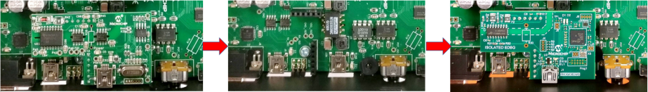

# MCHV3 Development Board - Setup and Running 'PMSM FOC PLL Estimator Application'
**Setting up the hardware**

The following table shows the target hardware for the application projects.

| Project Name| Hardware |
|:---------|:---------:|
| mchv3_sam_e70_pim.X | [MCHV3 Development Board](https://www.microchip.com/developmenttools/ProductDetails/dm330023-3) [ATSAME70 Plug-in module](https://www.microchip.com/Developmenttools/ProductDetails/MA320203) [Leadshine EL5-M0400-1-24 Motor](https://www.microchip.com/developmenttools/ProductDetails/AC300025)  [Isolated Embedded Debugger Interface](https://www.microchip.com/DevelopmentTools/ProductDetails/AC320202) |
|||

**Setting up [MCHV3 Development Board](https://www.microchip.com/developmenttools/ProductDetails/dm330023-3)**

- Mount the ATSAME70 Motor Control Plug In Module on U9 header. 

    

- Place the "PFC - External Opamp Configuration" Matrix board at J4.

    

- Motor Connections: 
    - Phase U - M1 
    - Phase V - M2 
    - Phase W - M3

    

- Jumper Settings: 
    - J11 - VAC ( Short Pin 3 - 4)
    - J12 - IA ( Short Pin 1 - 2)
    - J13 - IB ( Short Pin 1 - 2)
    - J14 - Fault_IP/IBUS ( Short Pin 1 - 2)

- Power the board with (110V/220V) AC mains. For additional safety, it is recommended to use a current limited power supply while testing this software demonstration on a non-default hardware and motor. 

    

- Installing Isolated Embedded Debugger
Default programmer or debugger daughter card shipped with the MCHV3 board cannot program or debug SAM series MCU and therefore, it needs to be replaced with an Isolated Embedded Debugger Interface for MCHV.

    

- Complete Setup

    

**Running the Application**

1. Build and Program the application using its IDE
2. Press switch PUSHBUTTON to start the motor
3. Vary potentiometer to change the speed of the motor
4. Press switch to stop the motor
5. Monitor graphs on X2C Scope

Refer to the following tables for switch and LED details:

| Switch | Description |
|------|----------------|
| PUSHBUTTON | To start or stop the motor |
||

| LED D2 Status | Description |
|------|----------------|
| OFF  | No fault  |
| ON   | Fault is detected  |
||